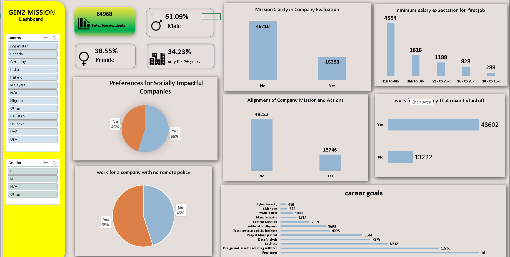
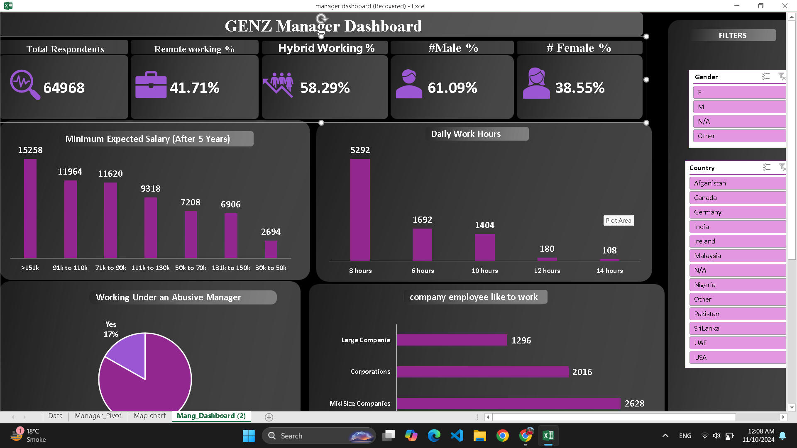
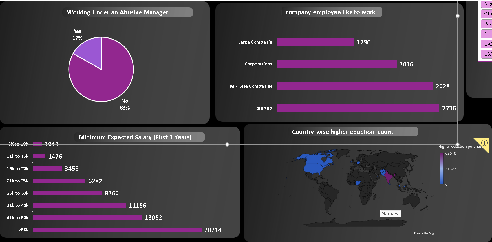

# Genz-Carrer-aspiration-Dashboard
#Questions-for-Manager-dashboard

1.Working Under an Abusive Manager
2.Remote Working
3.Daily Work Hours Willingness
4.Minimum Expected Salary (First 3 Years)
5.Minimum Expected Salary (After 5 Years)

Dashboard of manager 
 

Question for Mission dashboard

1.Mission Clarity in Company Evaluation
2.Alignment of Company Mission and Actions
3.Employee Preferences for Socially Impactful Companies

Key insights
∆.Many employees want more than 151k salary after 5 years.
!∆ Most of the employees wants to work daily 8 hours

∆ Many employees don't want to work with abuse manager..

∆ Many of the students from india they want to purchase higher education in Aborod.

∆ many of the students career goals is to do freelancer..

made in excel
